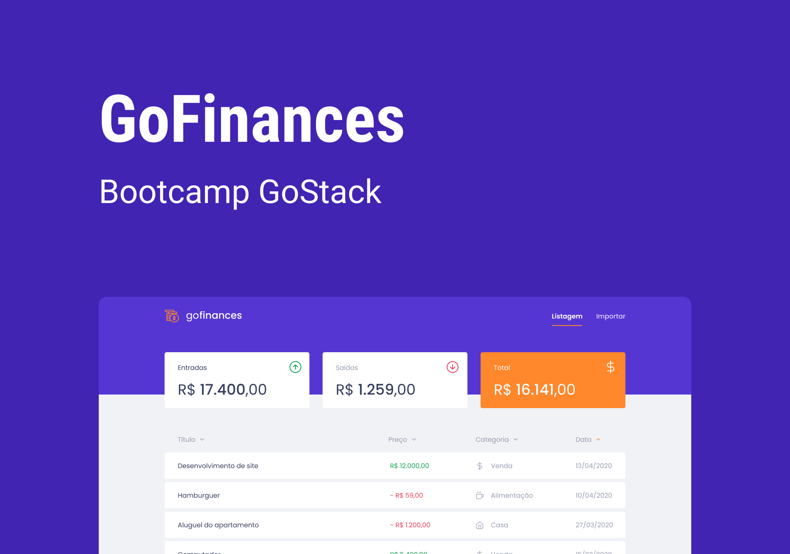

<h1 align="center">GoFinances Web</h1>

<p align="center">
  

  

  

  <a href="https://github.com/amandavianna/desafio-fundamentos-reactjs/commits/master">
    
  </a>
</p>

Aplicação de gestão de financeiras, a GoFinances, que exibe as transações criadas e permite a importação de um arquivo CSV para gerar novos registros no banco de dados.



## Como usar:

Essa aplicação se conecta ao backend do [desafio-database-upload](https://github.com/amandavianna/desafio-database-upload).

```bash
# Clone this repository
$ git clone https://github.com/amandavianna/desafio-fundamentos-reactjs

# Go into the repository
$ cd desafio-fundamentos-reactjs

# Install dependencies
$ yarn

# Run the app
$ yarn start
```
